```mermaid
flowchart TD;
    A(((While at a sleepover playing truth or dare you get dared to go into the local haunted house.)))-->D2[\Head to the house. You're no chicken!\]
    D2-->B[Standing in the foyer of the house you see your path divided.]
    B-->L2[\Head out the front door.\]
    B-->E[\Head upstairs to see if anyone is home.\]
    B-->F[\Go straight down the hallway to the sound of faint music.\]
    B-->G[\Go downstairs. The darkest places always have the best secrets.\]
    L2-->W[ You leave the house!]
    W-->D
    A-->C[\REFUSE! Lose truth or dare and go to sleep.\]
    C-->D>YOU SURVIVE]
    


    E-->H[You see a short hallway with a blue door on the left and a red door on the right.]
    H-->V[\Go back down the stairs.\]
    V-->B
    H-->I[\Reach for the blue door.\]
    I-->K[You see a fractured mirror with what appears to be blood dripping down the cracks.]
    K-->Y[\Slowly back out the room\]
    Y-->H
    K-->L[\Convince yourself it is ketchup and go check it out.\]
    L-->M[You get an intrusive thought to play Bloody Mary.]
    M-->N[\Play.\]
    N-->P[''bloody mary <br>Bloody Mary <br> BLOODY MARY'']
    P-->Q[Bloody Mary slowly fades into the mirror. The fractures spliting her. Causing the illusion of many haunted eyes staring back. She opens her mouth to talk.]
    Q-->R[\Run Out!\]
    R-->H
    Q-->S[\Listen.\]
    S-->T[Bloody Mary laughs. You are trapped in her trance as she points and laughs at you. Mocking you for your insecurities.]
    T-->U{{You died by Vicious Mockery.}}
    M-->O[\Don't play.\]
    O-->Y

    H-->J[\Open the red door. And enter.\]
    J-->Z[Clothes are sprawled out all over the bed. You look into the corner and see a reading nook with a comfortable but dusty rocking chair.]
    Z-->A1[\Fold the laundry. "A messy room leads to a messy mind" <br> Mother use to say.\]
    A1-->D1[Almost done! But you realize one sock is missing.]
    D1-->E1[\Look for the missing sock! You will go crazy if you don't.\]
    E1-->G1[Your compulsion to find the missing sock drives you to insanity as you spend the rest of your life searching endlessly.]
    G1-->H1{{Your OCD has led to your demise.}}
    D1-->F1[\You've done enough! It is someone elses problem now.\]
    F1-->I1[You take a look around the room again.]
    I1-->Z
    Z-->B1[\Rest in the rocking chair. Those were a lot of steep stairs!\]
    B1-->J1[A cat jumps in your lap! They have appeared to come out of nowhere!]
    J1-->K1[Due to the universal rule you can not get up until the cat moves you are stuck. Upon a closer look you realize this is a very friendly ghost tabby. He does not seem like he will be moving anytime soon.]
    K1-->L1{{You have died from cat cuddles.}}
    Z-->C1[\Nothing interesting. Head back to the hallway\]
    C1-->H
  


    F-->M1[You are led into the kitchen where a melancholy song is playing.]
    M1-->N1[You see an array of refreshments out on the counter. They look pretty fresh!]
    N1-->O1[\Grab a cookie!\]
    O1-->Q1[Oh no the double chocolate chunk has gotten stuck in your throat!]
    Q1-->R1[\Reach for a glass to get water!\]
    R1-->T1[Due to the houses many years of neglect the water filter has become disgusting. The water pours out brown but your desperation from choking blinds you from thoughts of sanitation. The water taste gross but it gets the chunk down.]
    T1-->U1[You leave the house with a stomach ache. You find out days later you have an infection. You are admitted to the hospital.]
    U1-->V1{{You die of dysentery}}
    Q1-->S1[\Do the heimlich on yourself using a chair!\]
    S1-->Z1[You spit out the chunk sending it flying. After a couple minutes of catching you breath you decide where to go next.]
    Z1-->A2[\Livingroom\]
    A2-->W1
    Z1-->B2[\Foyer\]
    B2-->B
    N1-->P1[\You leave the food. You don't trust it.\]
    P1-->W1[\Head into the livingroom.\]
    P1-->X1[\Head back to the foyer.\]
    X1-->B

    W1-->Y1[Upon walking into the livingroom you notice a skull on the coffee table. A paper laying next to it.]
    Y1-->E2[\Get closer to read the note.\]
    E2-->H2[Upon closer examination the paper is actually a business card. It reads 'Ron's Ruin Realty'. Just then the skull 'Ron' says ''Hello. This house is to die for. Want to buy it?'']
    H2-->I2[\A fixer upper could be fun. Buy it!\]
    I2-->K2[Congratulations! This house was a diamond in the rough. You went on to fix it up into your dream home!]
    K2-->D
    H2-->J2[\This isn't the nicest neighborhood. Decline the offer.\]
    J2-->M2[Ron ''the Never Resting Realtor'' continues to try and sell you on the house.]
    M2-->N2[\Cave in and buy it. How bad could it actually be?\]
    M2-->O2[\Ignore him and head back to the kitchen.\]
    O2-->M1
    N2-->K2
    Y1-->F2[\Just like Scooby use to say ''Ruh roh''. Go back to the kitchen.\]
    F2-->M1



    G-->P2[As you head down the stairs the scent of musk and mold smacks you in the face.]
    P2-->Q2[Reaching the bottom of the stairs you see what the smell is. Mountains of boxes, trash, papers, clothes, and more fill the basement. You see a path that makes a labyrinth throughout.]
    Q2-->R2[\Turn around and head back up the stairs.\]
    R2-->B
    Q2-->S2[\Venture forth.\]
    S2-->T2[One of the first boxes you find is a Costco size pack of toilet paper.]
    T2-->U2[\Leave it. You're in a basement. Not a bathroom. You don't need that right now.\]
    U2-->W2[\Go left\]
    W2-->Y2[\You end up getting lost within the maze. You search and search for the exit but to no avail.\]
    Y2-->Z2{{You died to bad navigation}}
    U2-->X2[\Go right\]
    X2-->A3[You stumble upon the family heirlooms where you find a box of jewelry you guess to be worth a lot of money!]
    A3-->B3[It takes you many hours to find your way out with the jewelry. You take the jewelry to get appraised and become a multi-millionaire. You end up spending your money traveling round the world.]
    B3-->D
    T2-->V2[\Take it. Unravel some as you go.\]
    V2-->C3[\Go left\]
    C3-->E3[You end up not finding anything interesting. You follow your trail back and go back to the stairs.]
    E3-->Q2
    V2-->D3[\Go right\]
    D3-->F3[You stumble upon the family heirlooms where you find a box of jewlrey you guess to be worth a lot of money!]
    F3-->G3[You easily follow your trail back to the stairs. In your excitement you immediately leave the house. You take the jewlrey to get appraised and become a multi-millionaire. You end up spending your money traveling round the world.]
    G3-->D


    classDef basementStyle fill: #BF9039, color: black;

    class P2,Q2,R2,S2,T2,U2,W2,Y2,Z2,X2,A3,B3,C3,D3,F3,G3,H3,V2,E3,G basementStyle;

    classDef groundStyle fill: #63B0F2, color: black;
    
    class F,M1,N1,O1,P1,Q1,R1,S1,T1,U1,V1,W1,X1,Y1,Z1,A2,B2,C2,E2,F2,G2,H2,I2,J2,K2,M2,N2,O2,L2,W groundStyle;

    classDef secondStyle fill: #A295BF, color: black;

    class E,H,V,B,I,K,L,M,N,O,P,Q,R,S,T,U,V,X,Y,J,Z,A1,D1,E1,G1,H1,F1,I1,J1,B1,K1,L1,C1 secondStyle

    classDef startStyle fill: #FFFFFF, color: black;

    class A,B startStyle;

    classDef oneStyle fill: #0FBF9F, color: black;

    class D2,C oneStyle; 

    classDef surviveStyle fill: #79D991, color: black;

    class D surviveStyle;


```

# Choose Your Own Adventure
  
  For my project I have decided to create a choose your own adventure. This was just a silly story to see if the player could survive in a haunted house. I used mermaid to create a flow chart since that would help visualize the choices and paths you could take easily. Every type of entity has a different shape. Start is a circle, descriptions are boxes, choices are rhombuses, death are hexagons, and survival is a flag. I even tried to use color to help from getting confused. Each level of the house are a different color second floor is purple, first floor is blue and basement is yellow. The start is also white, the first decisions are teal and survival is green. I tried to use the style classes to minimize the code instead of styling each individual node. 