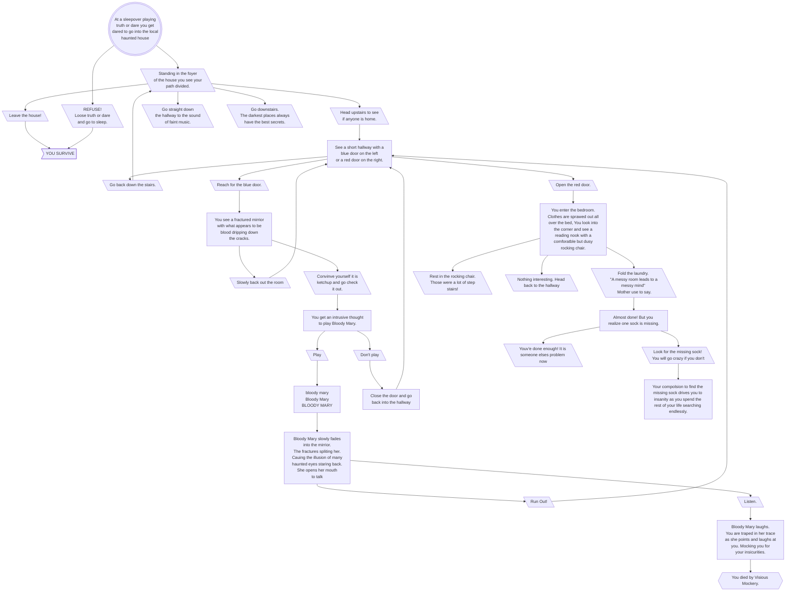

```mermaid
flowchart TD;
    A(((At a sleepover playing <br>truth or dare you get <br> dared to go into the local <br> haunted house)))-->B[\Standing in the foyer <br>of the house you see your<br> path divided.\]
    B-->W[\Leave the house!\]
    W-->D
    A-->C[\REFUSE! <br>Loose truth or dare <br> and go to sleep.\]
    C-->D>YOU SURVIVE]
    B-->E[\Head upstairs to see <br> if anyone is home.\]
    E-->H[See a short hallway with a <br> blue door on the left <br>or a red door on the right.]
    H-->V[\Go back down the stairs.\]
    V-->B
    H-->I[\Reach for the blue door.\]
    I-->K[You see a fractured mirrior <br> with what appears to be <br> blood dripping down <br> the cracks.]
    K-->Y[\Slowly back out the room\]
    Y-->H
    K-->L[\Convinve yourself it is <br>ketchup and go check<br>it out.\]
    L-->M[You get an intrusive thought <br> to play Bloody Mary.]
    M-->N[\Play\]
    N-->P[bloody mary <br>Bloody Mary <br> BLOODY MARY]
    P-->Q[Bloody Mary slowly fades <br> into the mirrior. <br>The fractures spliting her.<br> Cauing the illusion of many<br> haunted eyes staring back.<br> She opens her mouth <br>to talk]
    Q-->R[\Run Out!\]
    R-->H
    Q-->S[\Listen.\]
    S-->T[Bloody Mary laughs.<br> You are traped in her trace <br> as she points and laughs at <br> you. Mocking you for <br> your insicurities.]
    T-->U{{You died by Visious Mockery.}}
    M-->O[\Don't play\]
    O-->X[Close the door and go <br> back into the hallway]
    X-->H
    H-->J[\Open the red door.\]
    J-->Z[You enter the bedroom.<br> Clothes are sprawed out all <br> over the bed, You look into <br>the corner and see a<br> reading nook with a <br>comforatble but dusy <br>rocking chair.]
    Z-->A1[\Fold the laundry. <br> "A messy room leads to a messy mind" <br> Mother use to say.\]
    A1-->D1[Almost done! But you realize one sock is missing.]
    D1-->E1[\Look for the missing sock! You will go crazy if you don't\]
    E1-->G1[Your compolsion to find the missing sock drives you to insanity as you spend the rest of your life searching endlessly.]
    D1-->F1[\Youv'e done enough! It is someone elses problem now\]
    Z-->B1[\Rest in the rocking chair.<br> Those were a lot of step stairs!\]
    Z-->C1[\Nothing interesting. Head back to the hallway\]
    B-->F[\Go straight down <br>the hallway to the sound <br>of faint music.\]
    B-->G[\Go downstairs. <br>The darkest places always <br>have the best secrets.\]
    

```